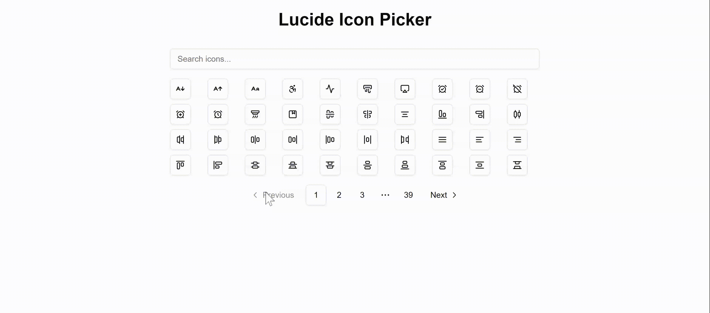

# Lucide Icon Picker for Next.js

A modern, responsive icon picker component for Next.js applications using Lucide Icons. This component provides a searchable, paginated interface for selecting icons from the Lucide icon library.



## Features

- 🔍 Searchable icon interface
- 📱 Responsive grid layout
- 📖 Pagination support
- ⚡ Optimized for Next.js 14 App Router
- 🎨 Built with Tailwind CSS and shadcn/ui
- 🔄 Real-time icon preview
- ✨ Smooth loading states

## Installation

### 1. Set up shadcn/ui

First, install and configure shadcn/ui in your Next.js project by following the [official installation guide](https://ui.shadcn.com/docs/installation/next):

```bash
npx shadcn-ui@latest init
```

During installation, follow the CLI prompts to set up your preferences.

### 2. Install Required Components

After setting up shadcn/ui, install the required components:

```bash
# Install button component
npx shadcn-ui@latest add button

# Install input component
npx shadcn-ui@latest add input

# Install pagination component
npx shadcn-ui@latest add pagination
```

> Note: shadcn/ui already includes lucide-react as a dependency, so you don't need to install it separately.

### 3. Add Component Files

Copy the following component files into your project:

- `components/Icon.tsx`
- `components/LucideIconSelector.tsx`

Your project structure should look like this:

```structure
components/
  ├── ui/
  │   ├── button.tsx
  │   ├── input.tsx
  │   └── pagination.tsx
  ├── Icon.tsx
  └── LucideIconSelector.tsx
```

## Usage

```tsx
'use client'

import { useState } from 'react'
import LucideIconSelector from '@/components/LucideIconSelector'
import Icon from '@/components/Icon'
import dynamicIconImports from 'lucide-react/dynamicIconImports'

export default function Page() {
  const [selectedIcon, setSelectedIcon] = useState<string | null>(null)

  return (
    <div className="space-y-4">
      <LucideIconSelector 
        onSelectIcon={(iconName) => {
          setSelectedIcon(iconName)
         
        }} 
      />
      
      {selectedIcon && (
        <div className="text-center font-medium">
          <p>Selected Icon: {selectedIcon}</p>
          <div className="flex justify-center mt-2">
            <Icon 
              name={selectedIcon as keyof typeof dynamicIconImports} 
              size={24} 
              aria-hidden="true" 
            />
          </div>
        </div>
      )}
    </div>
  )
}
```

## ⚠️ Performance Considerations and Warnings

### ⚠️ Important Note About Icon Imports

As mentioned in the [Lucide documentation](https://lucide.dev/guide/packages/lucide-react), this component uses dynamic imports for icons. While this approach works well with Next.js server-side rendering, you should be aware of the performance implications discussed in the Performance Considerations section below.

1. **Bundle Size Impact**
   - While Next.js 14's App Router handles dynamic imports efficiently through server-side rendering and streaming, the total number of available icons can still affect the initial JavaScript payload.
   - Each icon selection creates a separate chunk that is loaded on demand.

2. **Server Components Compatibility**
   - The component must be used with the 'use client' directive as it relies on client-side state management.
   - This means it cannot take advantage of some of Next.js 14's server component optimizations.

3. **Memory Usage**
   - The component implements icon caching to prevent repeated dynamic imports, which can consume memory if many different icons are selected during a session.

### Recommendations for Production Use

1. **Limited Icon Set**
   - If possible, consider creating a version of the picker that only includes the subset of icons you actually need.
   - You can modify the `allIcons` array in `LucideIconSelector.tsx` to include only specific icons.

2. **Lazy Loading**
   - Consider wrapping the entire icon picker in a lazy-loaded component if it's not needed on initial page load:
  
   ```tsx
   const LucideIconSelector = dynamic(() => import('@/components/LucideIconSelector'), {
     loading: () => <div>Loading...</div>,
     ssr: false
   })
   ```

3. **Bundle Analysis**
   - Regularly monitor your bundle size using tools like `@next/bundle-analyzer` to understand the impact:
  
   ```bash
   npm install --save-dev @next/bundle-analyzer
   ```

4. **Performance Monitoring**
   - Monitor client-side performance metrics, especially if the picker is used frequently in your application.
   - Consider implementing performance tracking for icon loading times.

## Technical Details

### Component Structure

- `Icon.tsx`: A wrapper component that handles dynamic icon imports with caching
- `LucideIconSelector.tsx`: The main picker component with search and pagination
- Uses shadcn/ui components for consistent styling and accessibility

### Props

```typescript
interface LucideIconSelectorProps {
  onSelectIcon: (iconName: string) => void;
}
```

### Performance Optimizations

- Memoized icon components to prevent unnecessary re-renders
- Icon caching to prevent repeated dynamic imports
- Debounced search input
- Pagination to limit the number of rendered icons
- Loading states for better UX

## Browser Support

- Works in all modern browsers
- Requires JavaScript to be enabled
- Best experienced in browsers that support CSS Grid and Flexbox

---

⭐ If you find this component useful, please consider giving it a star on GitHub!
